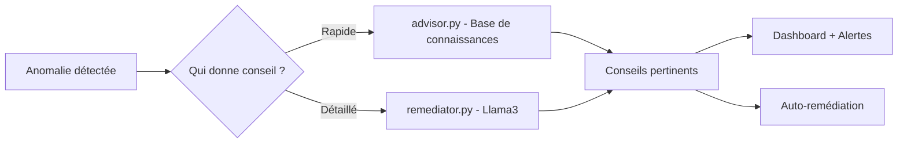

# NetPulse Shield — Guide complet (Français simple)

Ce document explique le projet NetPulse Shield en langage simple pour les débutants. Il décrit le but, l'architecture, comment exécuter le projet et le pipeline de traitement des données.

## 1. But du projet

NetPulse Shield est un système de détection d'anomalies / intrusions sur des flux réseau. Il prend des données réseau en entrée, les nettoie, applique un modèle de machine learning pour détecter des anomalies, puis génère des alertes et un tableau de bord.

## 2. Structure principale du dépôt

- `clean_data.py` : scripts pour nettoyer et préparer les données.
- `pipeline.py` : orchestrateur du flux (chargement, transformation, détection).
- `detector.py` : code qui utilise le modèle pour prédire anomalies.
- `remediator.py` / `auto_remediator.py` : actions automatiques ou manuelles pour répondre aux alertes.
- `dashboard.py` / `web_dashboard.py` : visualisation des alertes et métriques.
- `models/` : contient les modèles entraînés et les scalers.
- `data/` : jeux de données (exemples et sources).
- `tests/` : tests unitaires et d'intégration.

## 3. Pipeline (schéma)

Voici le flux principal sous forme de schéma Mermaid. Il montre les étapes de traitement des données :

```mermaid
flowchart TD
  A[Sources de données (CSV, flux)] --> B[clean_data.py]
  B --> C[pipeline.py]
  C --> D[detector.py]
  D --> E[models/netpulse_model.joblib]
  E --> F[Génération d'alertes]
  F --> G[remediator / auto_remediator]
  F --> H[dashboard / web_dashboard.py]

  subgraph stockage
    I[models/] & J[data/]
  end
  C --> I
  B --> J
```

Explication simple de chaque étape :
- `clean_data.py` : corrige les erreurs du fichier (colonnes, valeurs manquantes), normalise et sauvegarde un fichier propre.
- `pipeline.py` : exécute toutes les étapes dans l'ordre (nettoyage → détection → stockage des résultats).
- `detector.py` : charge le modèle et prédit si une ligne est normale ou anomalie.
- `remediator.py` : propose ou exécute des actions pour traiter les alertes.
- `dashboard` : montre les alertes et statistiques pour un utilisateur.

## 4. Installation (pas-à-pas)

1. Créer un environnement virtuel (Windows PowerShell) :

```powershell
python -m venv .venv
.\.venv\Scripts\Activate.ps1
```

2. Installer les dépendances :

```powershell
pip install -r requirements.txt
```

3. Vérifier que `models/netpulse_model.joblib` existe. Si non, suivre la section « Entraînement » (non couverte ici).

## 5. Exécution rapide (exemple)

1. Nettoyer les données d'exemple :

```powershell
python clean_data.py --input data/UNSW-NB15_1.csv --output data/cleaned.csv
```

2. Lancer le pipeline (détection) :

```powershell
python pipeline.py --input data/cleaned.csv --output results/alerts.csv
```

3. Lancer le dashboard local (si présent) :

```powershell
python web_dashboard.py
```

Note : adaptez les commandes si vos scripts utilisent d'autres arguments.

## 6. Tests

Exécuter les tests unitaires avec `pytest` :

```powershell
pytest -q
```

Si un test échoue, regardez les messages d'erreur et exécutez les scripts concernés sur un petit jeu de données d'exemple.

## 7. Fichiers importants et rôle

- `models/netpulse_model.joblib` : modèle entraîné. Ne pas modifier directement.
- `models/netpulse_model_scaler.joblib` : scaler pour normaliser les entrées.
- `data/` : contient les jeux de données et exemples.
- `tests/` : contient des cas de test et des fixtures.

## 8. Conseils pour contributeurs débutants

- Commencez par lire `docs/rapport_changements.md` pour comprendre les améliorations.
- Exécutez `clean_data.py` sur un petit fichier pour voir les transformations.
- Ajoutez un test avant de modifier du code (TDD simple).
- Utilisez des commits petits et descriptifs.

## 9. Comment le système donne des conseils de sécurité

Le système NetPulse Shield utilise une approche intelligente pour donner des conseils pertinents :

### Deux méthodes de génération de conseils

#### **Méthode 1 : Recherche dans une base de connaissances (RAG)**
- **Module** : `advisor.py`
- **Fonctionnement simple** :
  1. Une base de connaissances (`docs/remediation_knowledge.txt`) contient des conseils pré-écrits
  2. Quand une anomalie est détectée, le système cherche les conseils similaires
  3. Retour des 3 meilleurs conseils correspondants
- **Avantage** : Rapide et ne nécessite pas d'internet
- **Exemple** : Si l'anomalie ressemble à un "DDoS", retourner les conseils anti-DDoS

#### **Méthode 2 : Intelligence artificielle Ollama/Llama3**
- **Module** : `remediator.py`
- **Fonctionnement simple** :
  1. L'anomalie détectée est décrite au modèle LLM Llama3
  2. Llama3 analyse et généra un rapport structuré :
     - Type d'attaque détecté
     - Niveau de risque (critique, élevé, moyen, faible)
     - Explication technique
     - Commandes Cisco pour bloquer l'attaque
- **Avantage** : Conseils très détaillés et spécifiques
- **Prérequis** : Ollama + Llama3 doivent être lancés localement

### Schéma du flux complet



## 10. Glossaire simple

- Anomalie : un événement ou enregistrement qui diffère du comportement normal.
- Pipeline : série d'étapes qui transforment les données.
- Remédiation : action pour corriger ou répondre à une alerte.
- RAG : Technique pour chercher des conseils dans une base de données avant répondre.
- LLM : Modèle d'IA (Llama3) qui peut générer du texte intelligent.

---

Si vous voulez, je peux :
- remplacer `README.md` par cette version en français,
- ajouter des exemples concrets d'exécution pour chaque script,
- ou générer des tests unitaires basiques pour `clean_data.py`.
